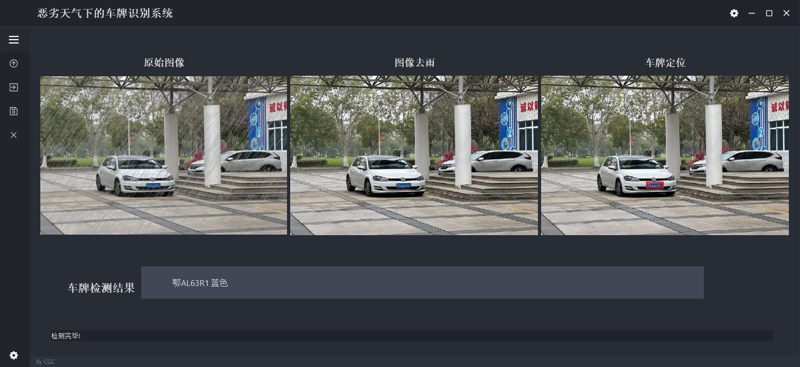

# 恶劣天气下的车牌识别系统


## Install
```bash
pip install -r requirements.txt
```

## Usage
```bash
python main.py
```

## Citation
本工程参考如下工作

```
@InProceedings{NeRD-Rain,
    author={Chen, Xiang and Pan, Jinshan and Dong, Jiangxin}, 
    title={Bidirectional Multi-Scale Implicit Neural Representations for Image Deraining},
    booktitle={Proceedings of the IEEE/CVF Conference on Computer Vision and Pattern Recognition (CVPR)},
    month={June},
    year={2024},
}
url = {https://github.com/cschenxiang/NeRD-Rain.git}
```

```
@software{yolov5,
  title = {Ultralytics YOLOv5},
  author = {Glenn Jocher},
  year = {2020},
  version = {7.0},
  license = {AGPL-3.0},
  url = {https://github.com/ultralytics/yolov5},
  doi = {10.5281/zenodo.3908559},
  orcid = {0000-0001-5950-6979}
}
```